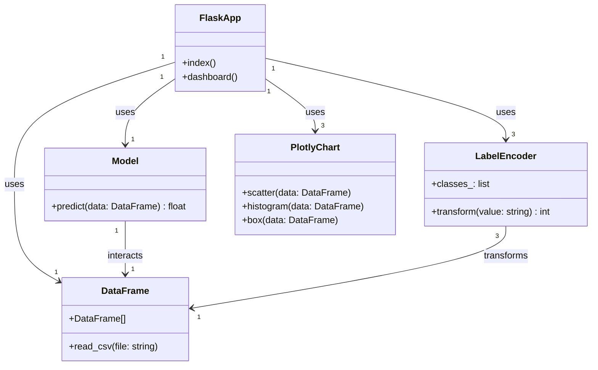

# Mon Application Flask avec Visualisation et Prédiction

Cette application est construite avec **Flask**, **pandas**, **Plotly** et un modèle de prédiction. Elle permet de charger des données, les visualiser, et obtenir des prédictions à partir d’un modèle entraîné.

## Fonctionnalités

- Interface Flask simple
- Visualisation des données (scatter, histogram, boxplot)
- Prédiction via un modèle de machine learning
- Encodage de labels pour la préparation des données

## Diagramme de classes

